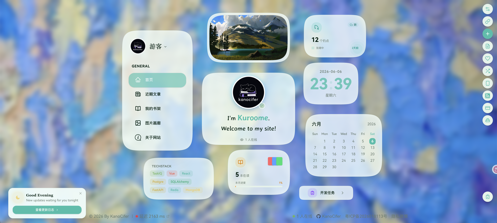
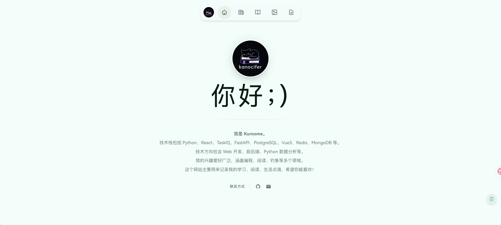
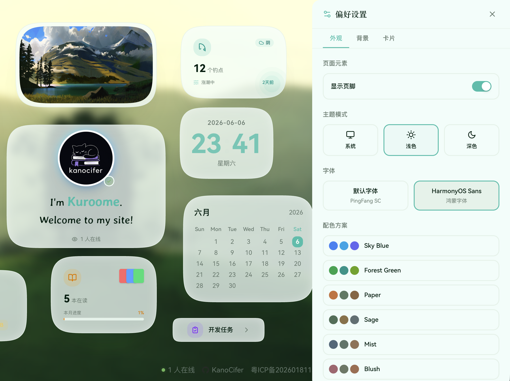
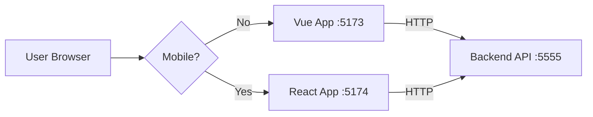

# kanocifer.chat — 前端

[](https://vuejs.org/)
[](https://react.dev/)
[](https://www.typescriptlang.org/)
[](https://pnpm.io/)
[](https://vitejs.dev/)
[](https://tailwindcss.com/)

[kanocifer.chat](https://kanocifer.chat) 的**前端实现** —— 桌面端 Vue 3 SPA + 移动端 React 19 SPA，共享 API 层、主题与类型。

> 后端（Python / Go）为**私有仓库**，不在本仓库内。本仓库是与后端解耦的纯前端工程。

---

## 目录

- [界面预览](#界面预览)
- [前端能力](#前端能力)
- [技术栈](#技术栈)
- [快速开始](#快速开始)
- [项目结构](#项目结构)
- [架构设计](#架构设计)
- [环境变量](#环境变量)
- [文档](#文档)
- [License](#license)

---

## 界面预览

|          首页 Bento 布局          |
| :------------------------------: |
|  |

|         关于页面         |        主题系统         |
| :----------------------: | :----------------------: |
|  |  |

## 前端能力

| 模块             | 说明                                                                 |
| ---------------- | -------------------------------------------------------------------- |
| **双端应用**     | 桌面端 Vue SPA + 移动端 React SPA，按 UA 自动分流                      |
| **共享层**       | `@readinglist/api`（请求层 + 全部 gateway）、`types`、`utils`、`brand` |
| **多主题系统**   | 4 套配色方案（paper / sage / mist / blush），CSS 变量一键切换        |
| **Bento 首页**   | Vue 端可拖拽重排卡片并保存布局；React 端 CSS 网格                    |
| **Markdown 博客**| 文章阅读/渲染、目录、代码高亮                                          |
| **微信读书**     | 书架视图、阅读统计、阅读进度                                          |
| **碎碎念 / RSS** | 轻量动态流与订阅阅读器                                                |
| **AI 交互**      | SSE 流式对话、文章总结                                                |
| **图库 / 工具箱** | 图片瀑布流、全屏查看、浏览器端压缩与格式转换                          |
| **图片工具箱**   | 纯本地 WebP/JPEG/PNG 转换与压缩，不上传                              |

## 技术栈

- **桌面端 (Vue)**：Vue 3.5 + TypeScript + Vite 8 + Tailwind CSS v4 + Pinia 3
- **移动端 (React)**：React 19 + TypeScript + Vite 8 + Tailwind CSS v4 + Zustand 5
- **共享层**：pnpm monorepo — `@readinglist/{api,brand,config,types,utils}`
- **测试**：Vitest 4 + happy-dom
- **规范**：oxlint + Prettier

## 快速开始

```bash
cd frontend
pnpm install          # 安装所有 workspace 依赖

pnpm run dev:vue      # 桌面端 dev server (:5173)
pnpm run dev:react    # 移动端 dev server (:5174)

pnpm run type-check   # 两端类型检查
pnpm run test         # 两端单测
pnpm run lint         # 两端 lint
```

> `pnpm run build` 仅在明确需要时执行；日常验证用 `type-check` / `test`。

本地开发需要后端在 `:5555` 提供 API，前端通过 Vite proxy 转发，避免跨域。

## 项目结构

```
kanocifer.chat/                 # 本仓库（开源前端）
├── frontend/                   # pnpm monorepo
│   ├── apps/
│   │   ├── vue-app/            # 桌面端 SPA（Vue 3）
│   │   └── react-app/          # 移动端 SPA（React 19）
│   └── packages/
│       ├── api/                # @readinglist/api — 请求层 + 全部 gateway
│       ├── brand/              # @readinglist/brand — 主题变量与 prose 样式
│       ├── config/             # @readinglist/config
│       ├── types/              # @readinglist/types — 跨端类型契约
│       └── utils/              # @readinglist/utils — 框架无关纯工具
├── docs/
│   ├── rules/                  # 前端规约（架构/风格/命令/领域/环境/测试）
│   ├── adr/                    # 架构决策记录
│   └── images/                 # 文档配图
├── plans/                      # 实现方案存档
├── design-demos/               # 设计方向稿
├── AGENTS.md                   # 顶层规约入口
├── CONTEXT.md                  # 领域词汇真源
├── PRODUCT.md                  # 产品定位
└── DESIGN.md                   # 设计系统
```

**前端约定**：两端 `src/` 按 `features/<业务域>/` 聚合页面与组件，没有顶层 `views/`；跨端复用的请求层、主题、类型统一下沉到 `frontend/packages/`。详见 [docs/rules/architecture.md](docs/rules/architecture.md)。

## 架构设计

### 双端 + UA 分流

访问根路径时按 **User-Agent** 识别设备：移动端（`mobile` / `tablet`）进入 React App，桌面端（`desktop`）进入 Vue App。



### 共享层职责

- **`@readinglist/api`** —— 唯一请求层。`apiClient` + 拦截器 + SSE 工具 + 全部 gateway。两端**不各自维护 gateway**，统一从此包导入。新增业务 gateway 也放这里。
- **`@readinglist/utils`** —— 零 React/Vue 运行时依赖的纯工具与领域纯函数（`domain/`）。
- **`@readinglist/types`** —— 与后端契约对齐的 DTO 类型，是跨端类型唯一真源。
- **`@readinglist/brand`** —— 主题 CSS 变量（4 套配色）与 `.prose` 文章样式，跨双端共享。

### 关键设计原则

1. **类型优先**：TypeScript strict，外部输入用 `unknown` + narrowing。
2. **颜色语义化**：一律走 Tailwind 语义 class（`bg-surface` / `text-muted`），取值来自 `@readinglist/brand` 主题变量，不写死色值。
3. **按业务域聚合**：`features/<domain>/` 组织，域内组件/composables/api 平铺，不建子目录。
4. **共享优先**：两端都要用的东西下沉 `packages/`，不要在 app 内各写一份。
5. **测试就近**：非平凡逻辑配一个 Vitest 用例，测试文件放被测模块同级 `__tests__/`。

## 环境变量

前端只读 `VITE_*` 前缀变量，配置在 `apps/<app>/.env`（不入库，模板见各 app 的 `.env.example`）：

| Variable                  | 说明                                             |
| ------------------------- | ------------------------------------------------ |
| `VITE_API_BASE`           | API 根地址（不设置时走 dev proxy）               |
| `VITE_JS_API`             | 站点 JS 配置标识                                 |
| `VITE_JS_API_TOKEN`       | 站点 JS 配置 token                               |
| `VITE_AMAP_SECURITY_CODE` | 高德地图安全码                                   |
| `GITHUB_CLIENT_ID`        | GitHub OAuth 客户端 ID                           |
| `GITHUB_OAUTH_URL`        | GitHub OAuth 授权端点                            |

> 密钥只走环境变量，不要提交 git。完整说明见 [docs/rules/environment.md](docs/rules/environment.md)。

## 文档

| 文档                                                     | 内容                                    |
| -------------------------------------------------------- | --------------------------------------- |
| [AGENTS.md](AGENTS.md)                                   | 顶层规约入口：硬规则 + 文档索引 + 工作流 |
| [CONTEXT.md](CONTEXT.md)                                 | **领域词汇真源**                        |
| [PRODUCT.md](PRODUCT.md)                                 | 产品定位与目标                          |
| [DESIGN.md](DESIGN.md)                                   | 设计系统（色板/排版/组件规范）           |
| [docs/rules/architecture.md](docs/rules/architecture.md) | 共享包、双端分流、前端结构约定           |
| [docs/rules/commands.md](docs/rules/commands.md)         | 常用命令速查                            |
| [docs/rules/code-style.md](docs/rules/code-style.md)     | Vue / React / 共享包代码风格            |
| [docs/rules/environment.md](docs/rules/environment.md)   | 前端环境变量                            |
| [docs/rules/testing.md](docs/rules/testing.md)           | 前端测试规范（Vue + React + Vitest）    |
| [docs/adr/](docs/adr/)                                    | 架构决策记录（不可逆决策）              |

## License

MIT
